# Debugging in Drupal 8
Note:
- KG
- Hello Everyone! We are going to talk about "Debugging in D8"

## Slides
[bit.ly/debugging-d8](http://bit.ly/debugging-d8)

Note:
I have posted slides with speaker notes online and bit.ly
link for this session is. You can follow along the slides.

## Kalpana Goel

<a href="https://www.drupal.org/u/kgoel"><i class="fa fa-drupal"></i> kgoel</a>

<a href="https://twitter.com/kalpanagoel"><i class="fa fa-twitter"></i> kalpanagoel</a>

Note:
- KG
- Developer at Forum One
- Forum One is full service digital agency and does lot of work in Drupal for
Government and non-profit organizations.

<!-- .element: class="heading" -->
<!-- .slide: data-background="custom/images/09September_1.jpg"  data-state="show-header" data-header="" -->
## First mention of bug and debugging
<!-- .element: class="heading" -->

Note:
- First reported bug in 1947
- Bug and debugging terms are attributed to Grace Hopper when she was working on computer at Harward University.
- Someone discovered moth stuck and stop the operation, she made a remark that they are debugging the system 
- and since then we are using that term.

## Debugging steps 
Note:
- Write tests so there are minimal chances of bug in your code
- if a bug does exist, reproduce a problem
- use debug in your code. In D7 - var_dump(), dpm
- find the source of the problem and fix it.

## Debugging in Drupal 8
Note:
- 

## 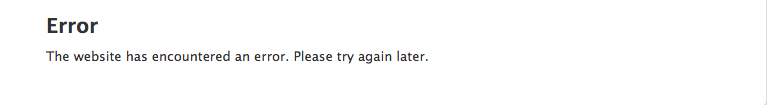
Note:
- If you see this sort of error (in my case long back while installing standard installation)
- doesn't give much information about error

### Enable Error Messages
## <pre><code data-trim>
$config['system.logging']['error_level'] = 'verbose';
</code></pre>
Note:
- cp examples.settings.local.php to settings.local.php, Uncomment lines in settings.php referring to settings.local.php 
 and uncomment the following the bottom of the file
- this turns CSS/JS aggregation off if you enable it
- Take a look in settings.local.php for in-depth documenation

## [drupal.org/node/2313059](http://www.drupal.org/node/2313059)
Note:
- No error shown by default
- NR would be great

###  Dynamic Page Cache
## <pre><code data-trim>
$settings['cache']['bins']['dynamic_page_cache'] = 'cache.backend.null';
</code></pre>
Note:
- uncomment from settings.local.php
- drush cr
- enabled by default???
- Cache only bit of the page for example user block or menu block which 
- displays dynamic info about user name and menu based on user permission
- won't be cached but everything else like static block

### Render Cache
## <pre><code data-trim>
$settings['cache']['bins']['render'] = 'cache.backend.null';
</code>
<code>
if (file_exists(__DIR__ . '/settings.local.php')) {
  include __DIR__ . '/settings.local.php';
}</code></pre>
Note:
- uncomment first part from settings.local.php
- uncomment second part from settings.php
- drush cr
- Explain why? if you have a piece of content and if you want to make a change in the node
or block twig template, to display the changes then you would need to clear the cache all the time
if you don't want to do that then disable render cache. 
- Render caching enable by default to speed up page load
- Since we are talking about twig templates, lets talk about debugging in Twig
 

## Twig debugging
Note:
- Drupal8 uses Twig as its templating engine 
- services.yml (turn on settings for enabling twig debugging is in services.yml)
- if not cp sites/default/default.services.yml to sites/default/services.yml

## How to enable debugging
<pre><code data-trim>
parameters:
  twig.config:
    debug: true 
</code></pre>
Note:
- enable twig debugging

## Benefits of enabling debugging in Twig
Note:
- Default: false
- dump() output template variables
- template file name suggestions
- Turn off in production
- It enables auto-reload

## Template file name
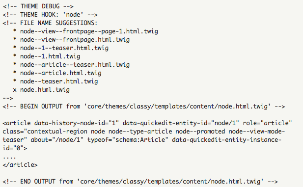
Note:
- where did you get the screenshot from?
- Twig template file name suggestions are in order from most specific to least specific
- current file name suggestion in use has an "x" beside it
- Along with the BEGIN OUTPUT and END OUTPUT you will find the full path to the template being rendered

## Twig auto-reload
Note:
- This is another benefit of enabling Twig debug option
- automatically recompile Twig templates if source code changes
- Turn off in production
- look in services.yml file to read more about it

## Twig cache
Note:
- explain why?
- Its bad to disable twig cache
- don't touch it

## kint
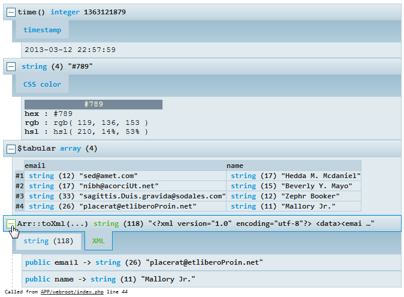
<pre><code data-trim>
parameters:
  kint($vars);
</code></pre>
Note:
- do you have an example of this?
- may be already familiar with knit
- It's way better than dump()
- kint module is sub-module of devel module which you can use as a debugging tool. you can use it from php or twig template.

## kint - backtrace
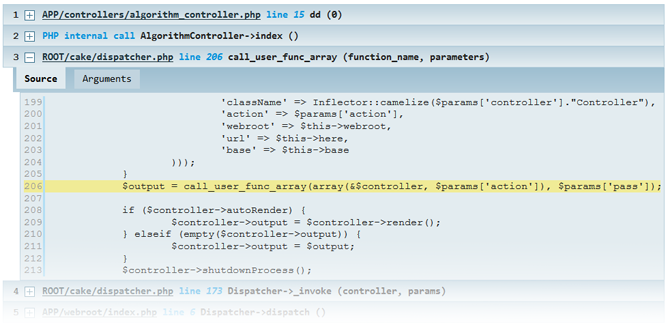
<pre><code data-trim>
parameters:
  kint_trace();
</code></pre>

Note:
- do you have an example of this?
- may be already familiar with knit
- It's way better than dump()
- kint module is sub-module of devel module which you can use as a debugging tool. you can use it from php or twig template.

## kint - different themes
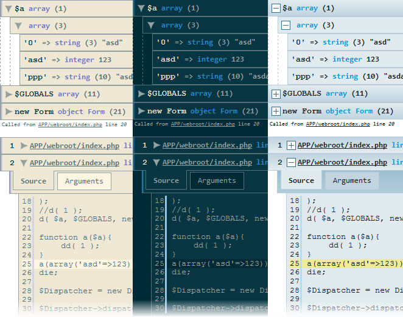

Note:
- do you have an example of this?
- may be already familiar with knit
- It's way better than dump()
- kint module is sub-module of devel module which you can use as a debugging tool. you can use it from php or twig template.

### Console
[drupalconsole.com](http://drupalconsole.com)
[bit.ly/console-doc](http://bit.ly/console-doc)
Note:
- Drupal console is a suite of tools rum from CLI
- It helps with debug, clear cache and run other useful commands from command line
- Run drupal-list and it will give you list of commands that can be run from CLI
 

## Web-profiler
Note:
- useful for debugging, performance testing
- learn how your site handles request
- Symfony 2 comes with WebProfiler bundle. It collects information about each request made to your site
- Allows to visualize data in the browser
- WebProfiler is now a sub-module of devel

## WebProfiler in browser
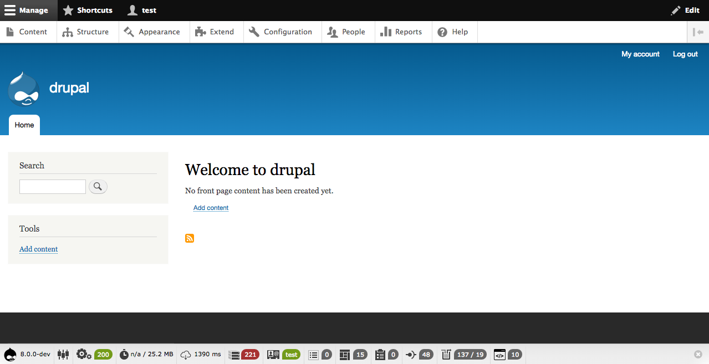
Note:
- Download devel module
- enable devel and webprofiler module
- clear cache
- Set the permission

## PHP Config
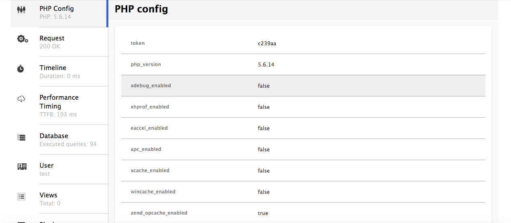
Note:
- Details about PHP version, enabled extensions

## Request Info
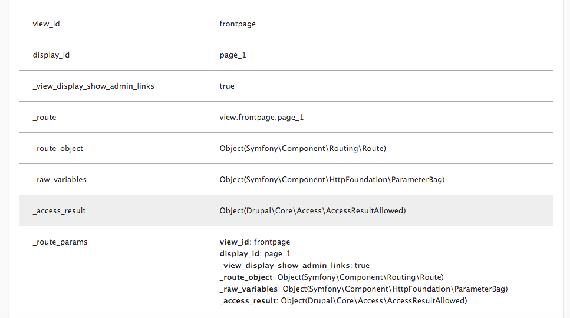
Note:
- Info related to page request example - route matched, route object, request header, cookies

## Timeline
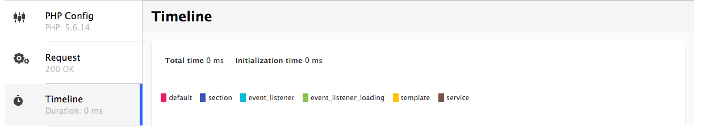
Note:
- Allows to visualize the order in which PHP controllers and events are called and time to compile them.
- Helps debug slow page load

## Performace Timing
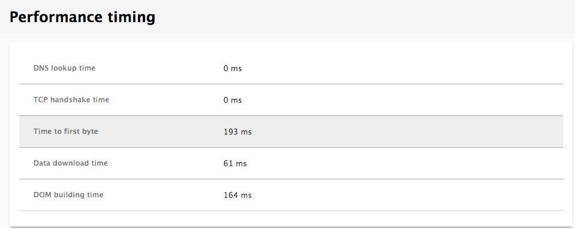
Note:
-

## Database
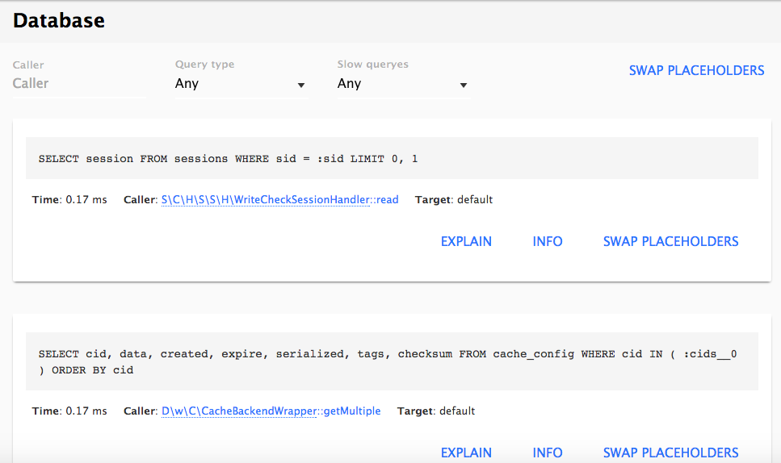
Note:
- queries are listed in execution order with ability to search by filter (select, insert)
- or filter by slow query
- displays execution time, PHP file that made query

## Database
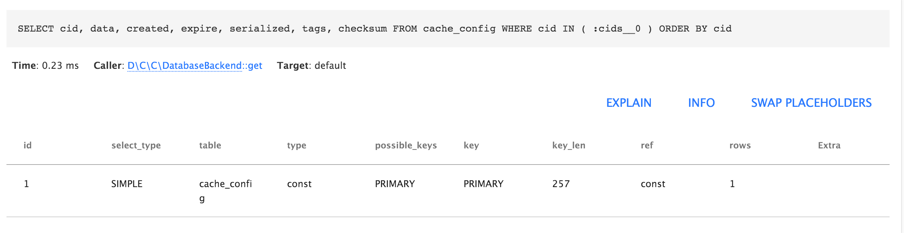
Note:
- Click on "explain" details about type of query (fast or slow)
- table
- display info and swappable key 

## User
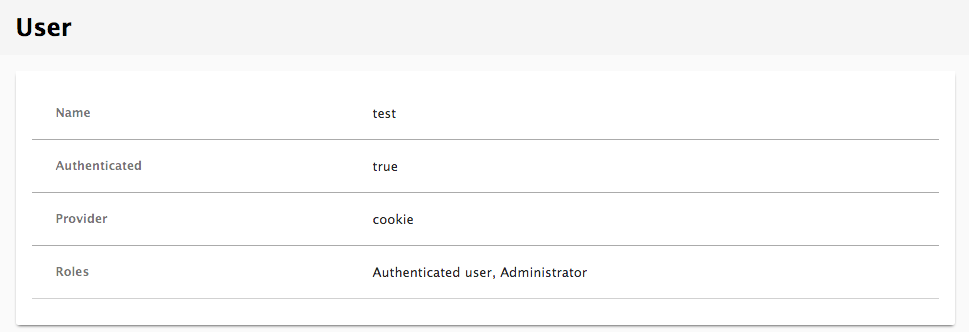
Note:
- Name of current user
- roles etc.
- Provider - If basic oauth module is enabled and basic configuration is setup then
it will display basic auth. In thos case its cookie

## Views
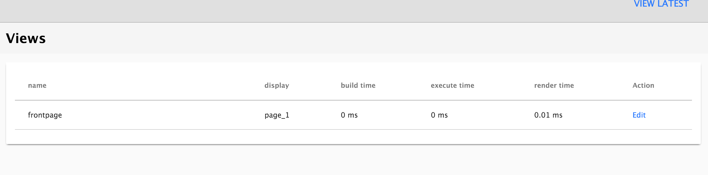
Note:
- Displays list of views that was rendered on the current page

## Forms
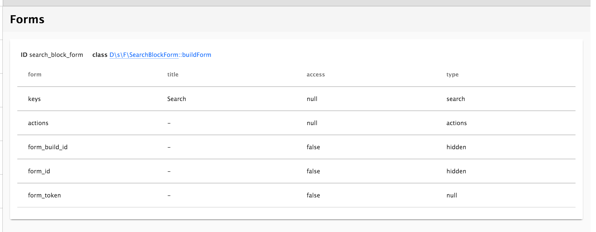
Note:
- Lists forms built on the current page

## Extensions
Note:
- Displays all the modules and themes that are enabled on the site

## Cache
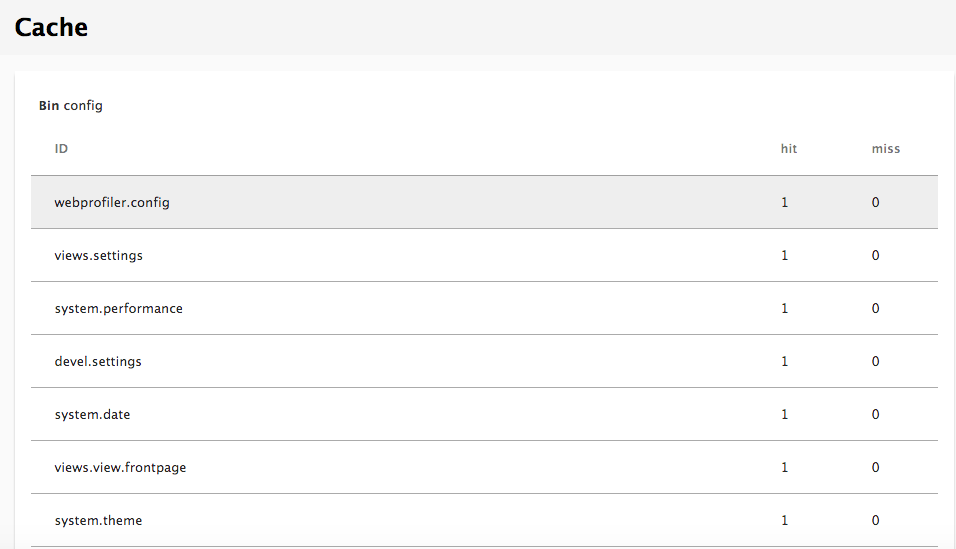
Note:
- Displays different caches by ID and the number of hits/miss

## Assets
Note:
- Provides list of all CSS and JS files that were loaded for the page request

## <video data-autoplay src="custom/images/webprofiler_video.mov"></video>

## Thank You!
## Don't forget to rate session

