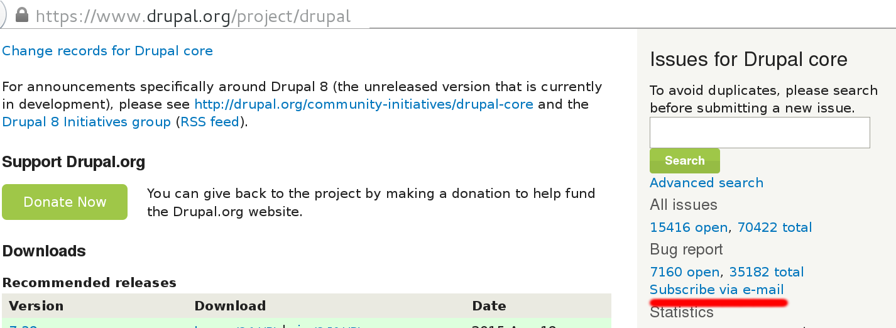
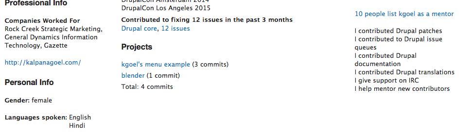
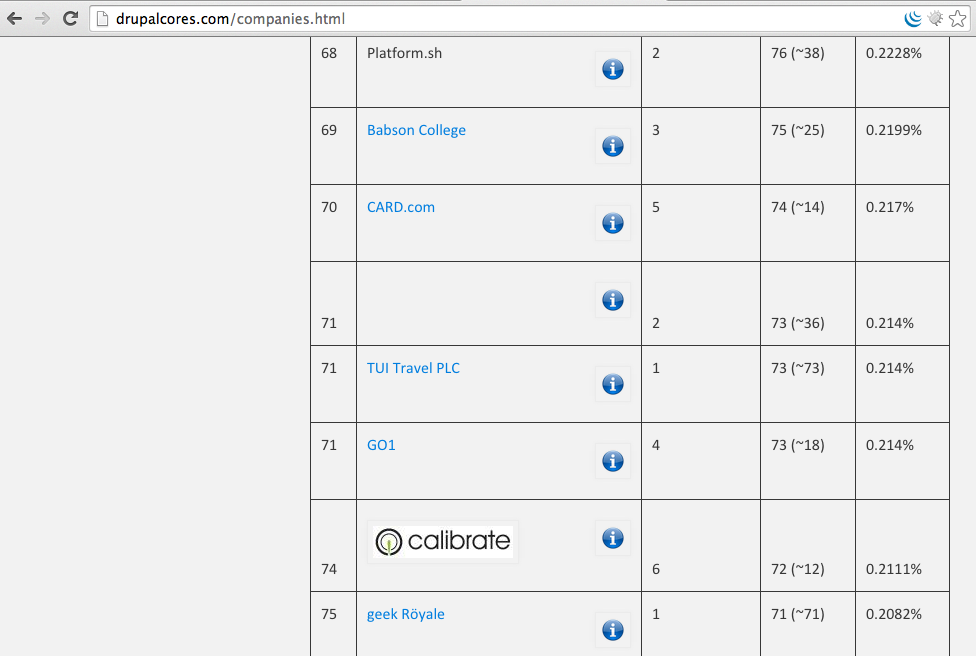
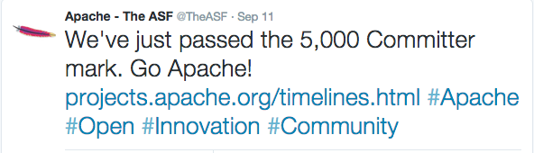
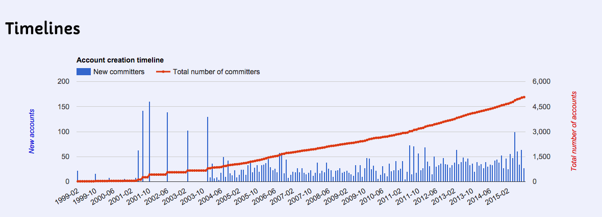
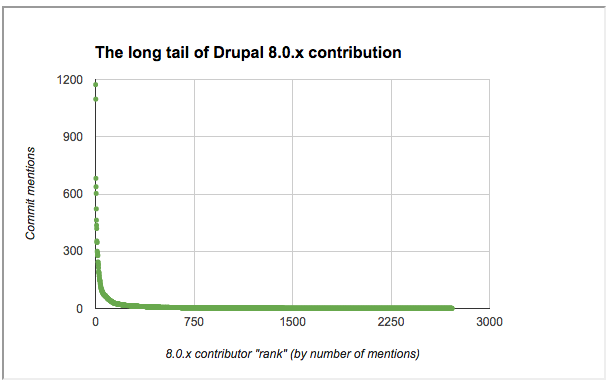

# Debugging in Drupal 8
Note:
- KG
- Hello Everyone! We are going to talk about "Debugging in D8"

## Slides
[bit.ly/pain-points-slides](http://bit.ly/pain-points-slides)

Note:
I have posted slides with speaker notes online and bit.ly
link for this session is. You can follow along the slides.

## Kalpana Goel

<a href="https://www.drupal.org/u/kgoel"><i class="fa fa-drupal"></i> kgoel</a>

<a href="https://twitter.com/kalpanagoel"><i class="fa fa-twitter"></i> kalpanagoel</a>

Note:
- KG
- Developer at Forum One
- Forum One is full service digital agency and does lot of work in Drupal for
Government and non-profit organizations.

<!-- .slide: data-background="custom/images/" data-background-size="" data-state="show-header" data-header="" -->

<!-- .element: class="heading" -->
<!-- .slide: data-background="custom/images/09September_1.jpg"  data-state="show-header" data-header="" -->
## First mention of bug and debugging
<!-- .element: class="heading" -->

Note:
- KG
- First reported bug in 1947
- Bug and debugging terms are attributed to Grace Hopper when she was working on computer at Harward University.
- Someone discovered moth stuck and stop the operation, she made a remark that they are debugging the system 
- and since then we are using that term.

## Debugging steps 
Note:
- Write tests so there are minimal chances of bug in your code
- if a bug does exist, reproduce a problem
- use debug in your code. In D7 - var_dump(), dpm
- find the source of the problem and fix it.

## Debugging in Drupal 8
Note:
- 

## <!-- .slide: data-background="custom/images/website_error.png" data-background-size="" data-state="show-header" data-header="" -->
Note:
- If you see this sort of error (in my case long back while installing standard installation)
- doesn't give much information about error

## https://www.drupal.org/node/2313059
Note:
- No error shown by default
- NR would be great

## $config['system.logging']['error_level'] = 'verbose';
Note:
- Add this in settings.php
- where?

## 
Note:
- KG

## 

Note:
- KG

##

Note:
- Val

##
Note:
-

##

Note:
-

##
Note:
- KG

##
Note:
- KG

## Credit to mentors
Note:
-

## User profile

## User profile

Note:

##
Note:

## Companies

##

Note:
-

##

Note:
-

##

Note:

##

<small>photo credit: </small>
Note:

##
*
*
Note:
-

##

## Thank You!
## Don't forget to rate session

